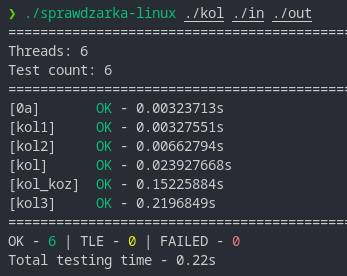

# Sprawdzarka do OI

Ten program automatyzuje sprawdzanie programu na dużej ilości testów.  
Stworzyłem go aby automatycznie testować swoje programy na OI.

## Screenshot

## Sposób użycia

Aby dowiedzieć się jak korzystać z tego programu wywołaj go z flagą `--help`.  
Program przyjmuje pliki wykonywalne, nie należy podawać plików z kodem źródłowym.  
`input` i `output` powinny być podane jako foldery, a pliki powinny być ponazywane odpowiednio `<nazwa>.in` dla wejścia, oraz `<nazwa>.out` dla wyjścia

## Zastrzeżenia

Ze względu na konstrukcję w niektórych przypadkach program może pokazywać wolniejszy czas wykonania niż jest normalnie.

Wersja na windows jest niestabilna i wolniejsza.

## Python

Python nie jest wspierany.

### **Nie gwarantuję, że program będzie pasował do twoich potrzeb, ani, że będzie utrzymywany!**
